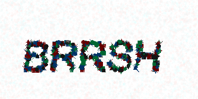
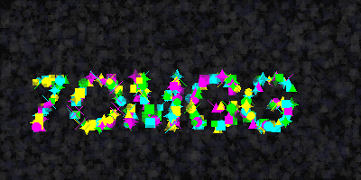
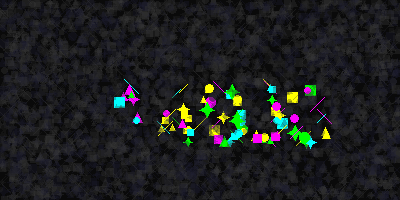

# Dotcha 🌀

**Dotcha** is a high-performance Python library for generating captchas based on the **Gestalt Illusion** principle. It creates visual patterns from thousands of geometric shapes that are intuitive for humans but highly resistant to automated OCR and AI solvers.

## Features
- 🎨 **Gestalt Illusion**: Pure geometric rendering for maximum machine-learning resistance.
- ⚡ **High Performance**: Optimized rendering (~30ms per PNG).
- 🔄 **Animated GIFs**: "Temporal Gestalt" effect where text is reconstruction through motion.
- 🛡️ **Fuzzy Validation**: Intelligent answer verification with Levenshtein distance.
- 🌓 **Universal Themes**: Light, Dark, and fully customizable color schemas.
- 📉 **Scalable Difficulty**: Dynamic calibration from clear patterns to chaotic noise.
- 🤖 **Async Ready**: Native `asyncio` support for web frameworks and bots.

## Visual Examples

| Light Theme (EASY) | Dark Theme (MEDIUM) | Animated (Temporal Gestalt) |
|:---:|:---:|:---:|
|  |  |  |

## Installation

```bash
pip install Pillow
```

## Quick Start

### Synchronous PNG
```python
from dotcha import CaptchaGenerator, Theme

gen = CaptchaGenerator(theme=Theme.LIGHT)
text, buffer = gen.generate()

with open("captcha.png", "wb") as f:
    f.write(buffer.read())
print(f"Generated captcha: {text}")
```

### Asynchronous GIF
```python
from dotcha import CaptchaGenerator, Theme, Difficulty

async def send_captcha():
    gen = CaptchaGenerator(theme=Theme.DARK, difficulty=Difficulty.HARD)
    text, buffer = await gen.agenerate_gif(frames=12)
```

> 💡 See [examples/bot_demo.py](examples/bot_demo.py) for a complete Telegram bot integration.

### Fuzzy Verification
```python
from dotcha import CaptchaGenerator

user_input = "ABCDE"
actual = "ABCD1"

# Accepts answer with 1 char distance
is_valid, distance = CaptchaGenerator.check_answer(user_input, actual, fuzzy_tolerance=1)
if is_valid:
    print(f"Passed! Distance: {distance}")
```

## Why Dotcha?
- **Pattern-Based Security**: While a human brain naturally connects scattered dots into characters, standard OCR algorithms perceive them as disconnected noise.
- **Temporal Signal**: The GIF format utilizes "Temporal Sparsity". A static frame is unreadable, but the human eye integrates movement into a clear signal.
- **Zero Disk Footprint**: Captchas are generated directly into byte buffers, making it ideal for high-concurrency environments.
- **Stable & Lightweight**: Explicit resource management and minimal dependencies.

## Performance

### Static Images (PNG)
| Difficulty | Time | Shapes | Description |
|------------|------|--------|-------------|
| **EASY**   | ~0.05s | 8000   | High density, very clear for humans. |
| **MEDIUM** | ~0.03s | 5000   | Balanced density and noise. |
| **HARD**   | ~0.02s | 3500   | Sparse text, higher background chaos. |

### Animated Captchas (GIF)
| Difficulty | Time (12 frames) | Security Level |
|------------|-----------------|----------------|
| **EASY**   | ~0.51s          | Maximum (High signal integration) |
| **MEDIUM** | ~0.38s          | Standard |
| **HARD**   | ~0.32s          | Extreme (Sparse signal in motion) |

> *Note: Timings are based on a standard modern CPU. Generation is offloaded to background threads to keep your bot responsive.*

## License
This project is released into the public domain under the [Unlicense](LICENSE).
